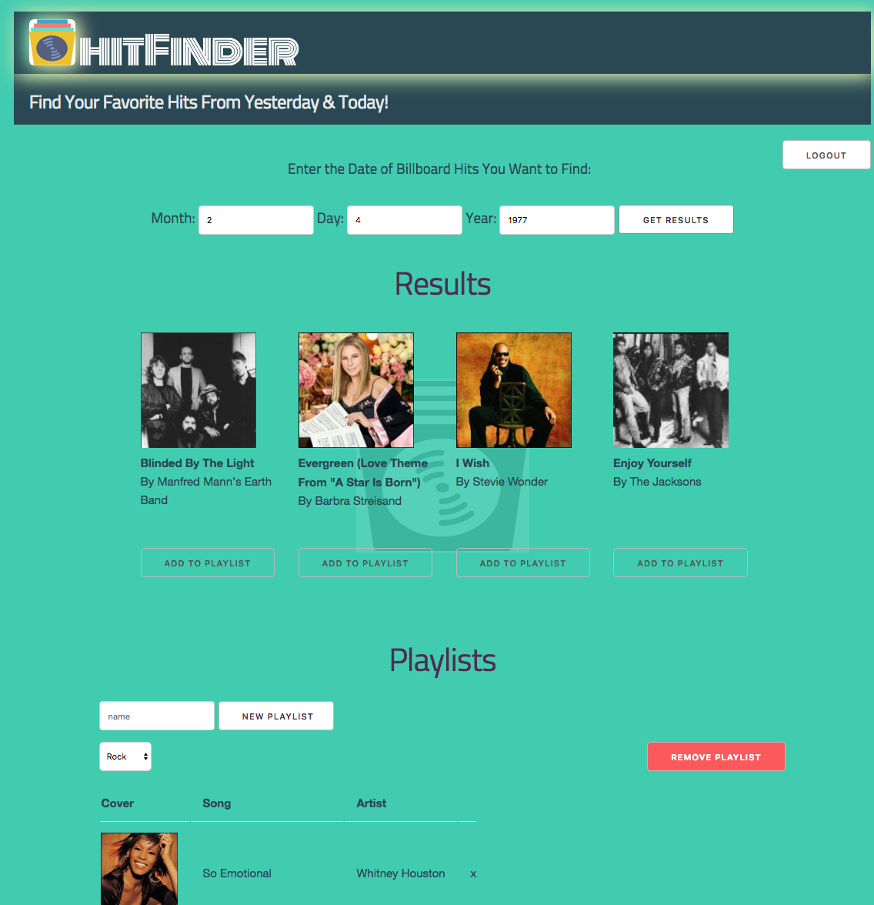

# [hitFinder](https://mighty-island-52745.herokuapp.com/)

## Find Your Favorite Hits From Yesterday & Today!
## Authors
#### [_Justin Dang_](https://github.com/dangjustintime)
#### [_Evan Connors_](https://github.com/ECBConnors)
#### [_Amit Zaman_](https://github.com/amitzed)

### Sometimes you wonder what songs most people were listening to on a certain day back in time, whether the day was yesterday or on June 21, 1968.  It's likely that this music was created in response to events in the world or even helped shaped cultures like "Folsom Prison Blues" by Johnny Cash.  [hitFinder](https://mighty-island-52745.herokuapp.com/) is an app you can use to travel in musical time.  You can save songs from different pinpoints in time to create your own musical universe.

### Design:
In the interface of hitFinder an unregistered user can do a search for a list of hit songs by month, day and year, but they must be a registered and logged-in user to be able to create, edit, delete and save their personal playlists.  Registed users can delete individual songs in their playlist or the whole playlist itself.

### Technologies Used:
Mongoose, Express, AngularJS, Node.JS, Skeleton Framework,
NPMs: billboard-top-100, express, mongoose, express-sessions, bcrypt.

### Approach:
When we first embarked on creating this app, we discussed what we wanted the app to do after determining that we wanted it to be centered around music.  We looked at APIs from Napster and Spotify and finally decided on Billboard to receive information from their databases.  Then we focused on functionality while always keeping the user's experience in mind.  We began developing the basic functionality and once that was achieved, we expanded it further and moved to the visual aspects of the site.  Developing the visual aspects involved decisions on complementary colors to use, the framework, which was Skeleton, and then some animation that wasn't too distracting from the main purpose of the app.  As a strong team, the shared and separate tasks of the project were rolled out and completed efficiently, enhanced through the use of of ZenHub.

### Future Expandability:
In the future, we would want to add a functionality where when a song in a playlist is clicked, the song would play, and additionally add a feature where all the songs in the playlist would play one after another.

### Heroku Link:
https://mighty-island-52745.herokuapp.com/
